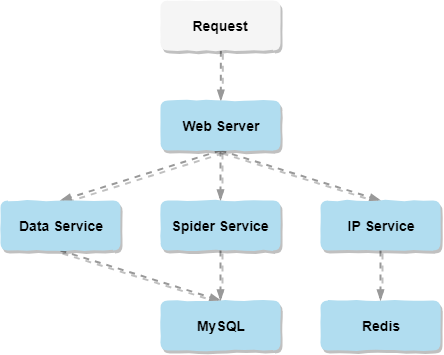

简介：做这个项目的初衷是因为对音乐的热爱和突发的臆想：寻找音乐世界中的有缘人。从2019年的3月开始，从臆想的迸发，到前后台的设计，再到编码实现，到最后的测试部署。这一路上除了自己的努力学习和奋力前行，也感谢指点过我的老师和帮助过我的同学朋友以及网友。通过做这个项目不仅巩固了已有的知识，还学习了很多新知识运用其中。目前小程序端已经实现了类似网易云音乐的音乐播放器，还有特有的音乐互动，以及专属推荐等功能。后台主要的支撑技术有推荐算法、爬虫技术和IP代理。

寻找最佳音缘_服务端

* [系统架构图](#系统架构图)
* [演示效果图](#演示效果图)
* [开发环境](#开发环境)
* [推荐算法](#推荐算法)
* [爬虫技术](#爬虫技术)
* [IP代理](#IP代理)

## 系统架构图

## 演示效果图

## 开发环境
* 操作系统：Windows 10 x64
* 开发工具：Eclipse、PyCharm
* 数据库：MySQL 5.7、Redis 4.0
* 服务器：Tomcat 9.0

## 推荐算法
### 协同过滤

## 爬虫技术

## IP代理

<a href="https://github.com/Kevin-free/yinyuan_weapp" rel="nofollow">寻找最佳音缘_微信小程序端</a>
