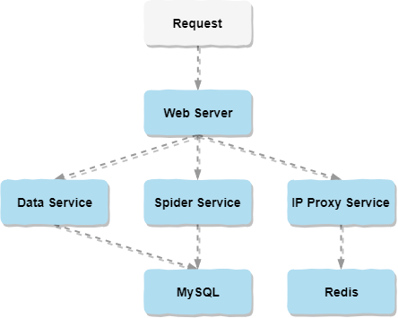

简介：做这个项目的初衷是因为对音乐的热爱和突发的臆想：寻找音乐世界中的有缘人。从2019年的3月开始，从臆想的迸发，到前后台的设计，再到编码实现，到最后的测试部署。这一路上除了自己的努力学习和奋力前行，也感谢指点过我的老师和帮助过我的同学朋友以及网友。通过做这个项目不仅巩固了已有的知识，还学习了很多新知识运用其中。目前小程序端已经实现了类似网易云音乐的音乐播放器，还有特有的音乐互动，以及专属推荐等功能。后台主要的支撑技术有推荐算法、爬虫技术和IP代理。

寻找最佳音缘_服务端

* [系统架构图](#系统架构图)
* [演示效果图](#演示效果图)
* [开发环境](#开发环境)
* [推荐算法](#推荐算法)
* [爬虫技术](#爬虫技术)
* [IP代理](#IP代理)

## 系统架构图

## 演示效果图

## 开发环境
* 开发语言：Java、Python
* 数据库：MySQL 5.7、Redis 4.0
* 服务器：Tomcat 9.0

## 推荐算法
本系统采用的是基于协同过滤并加以改进的推荐算法。
### [协同过滤算法](https://baike.baidu.com/item/协同过滤/)
协同过滤（Collaborative Filtering，简称CF）是一种最经典的推荐算法。

协同过滤算法主要通过分析用户的历史数据，用以构建用户模型并进行推荐。协同过滤算法主要分为以下两类：一类是基于用户的协同过滤算法（User-Based Collaborative Filtering，简称UserCF），另一类是基于物品的协同过滤算法（Item-Based Collaborative Filtering，简称ItemCF）。

1. 基于用户的协同过滤算法

UserCF算法的核心是用户，思想是“人以群分”。算法的基本思路是：首先找到和目标用户喜好相似的邻居用户集体，然后以此为基础计算出目标用户对未操作物品的喜好预测评分，根据评分的高低推荐前N个给目标用户。  
如图3-3所示，形象的表现了基于用户的协同过滤算法的总体思想：假设用户C为目标用户，根据图3-3可知，因为用户A和用户C由相同评分物品C和D，可知用户C的相似用户为用户A；又因为用户A已评分的集合物品A是用户C未操作的，所以将物品A推荐给目标用户C。  

## 爬虫技术

## IP代理

<a href="https://github.com/Kevin-free/yinyuan_weapp" rel="nofollow">寻找最佳音缘_微信小程序端</a>
